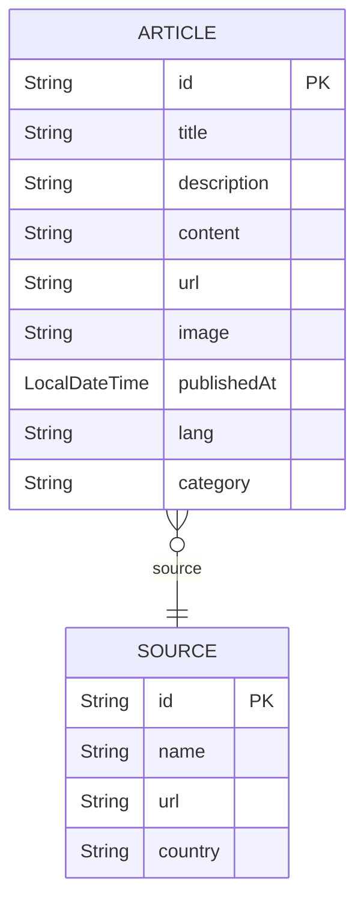
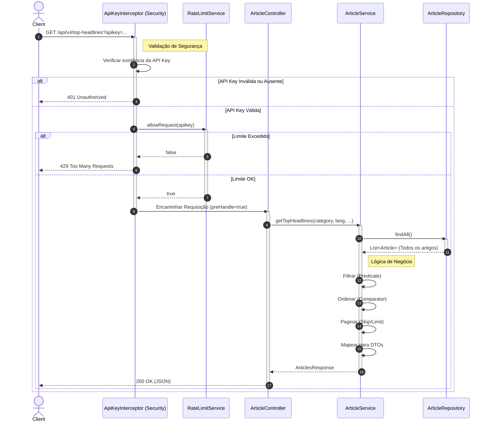

# Diagrama ERD (Baseado no Domínio)

Como o projeto atualmente utiliza `records` Java para o modelo de domínio e não possui entidades JPA (`@Entity`), este diagrama representa a estrutura lógica baseada nas classes de domínio existentes (`Article` e `Source`).

# Diagrama de Sequência (Fluxo de Endpoint)

Este diagrama demonstra o processo de uma requisição para o endpoint `/api/v4/top-headlines`, incluindo validação da chave da API, verificação de rate limit e consulta aos dados.

